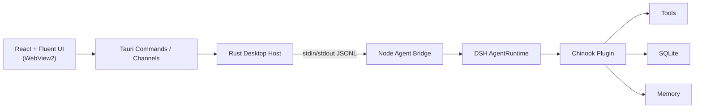

# DSH Chinook Desktop Agent

English | [简体中文](README.zh-CN.md)

A Windows-first desktop AI music-store assistant built on DeepSeek Harness (DSH), featuring tool calling, persistent sessions, customer-scoped memory, real Chinook business data, and an agent-native Tauri desktop interface.


## Key Features

- **Agent-native desktop chat** — chat with a music-store business agent instead of browsing tables
- **Real-time assistant streaming** — replies stream token by token into the conversation
- **Visible Tool Activity** — every tool call is surfaced live, not hidden inside the model
- **Music catalog search** — find artists, albums and tracks across the Chinook catalog
- **Music recommendation** — similar albums and genre popularity, grounded in real data
- **Order lookup** — customers can ask about their own orders in natural language
- **Invoice ownership protection** — invoice details are only readable for the current customer
- **Customer-scoped long-term memory** — facts are remembered per customer and used in later sessions
- **Persistent DSH sessions** — each conversation is a durable agent session
- **Historical session restore** — reopen old sessions from the sidebar and keep talking
- **Activity Drawer** — a full, inspectable trace of the agent run: model turns, tool calls, timings
- **Sidecar crash detection and recovery** — the agent process is watched, restarted and reconnected automatically

## Architecture



| Layer | Role |
| --- | --- |
| React + Fluent UI | Presentation. Pure chat/timeline UI; never touches the database or the model |
| Rust Desktop Host | Window, app lifecycle, and the single long-lived agent sidecar process |
| Node Agent Bridge | Transport adapter — speaks JSONL over stdin/stdout between the host and the agent runtime |
| DSH AgentRuntime | The DeepSeek Harness agent core: sessions, model calls, tool dispatch, memory |
| Chinook Plugin | Business layer — the 7 Chinook domain tools backed by SQLite and customer memory |

## Agent Capabilities

The agent exposes seven domain tools to the model:

| Tool | What it does |
| --- | --- |
| `search_catalog` | Search the music catalog by artist, album or track |
| `find_similar_albums` | Recommend albums similar to a given album |
| `popular_in_genre` | Show what is popular within a music genre |
| `list_my_orders` | List the orders of the current customer |
| `get_invoice_details` | Read the line items of one invoice (ownership-checked) |
| `remember` | Store a fact about the current customer into long-term memory |
| `recall` | Retrieve stored facts about the current customer |

## Desktop Experience

The desktop app wraps the same agent core as the original CLI. The home screen is a chat view with a live activity strip: while the agent works you see the current step (model turn, tool call, tool result) and the reply streams in real time. The **Activity Drawer** holds the full trace of each run. The sidebar lists persistent DSH sessions, including historical ones that can be restored. The agent runs as a child Node process under the app's control — if it crashes it is restarted automatically and the session reconnects.

## Tech Stack

| Area | Choice |
| --- | --- |
| Frontend | React 18 + Fluent UI v9, rendered in WebView2 via Tauri v2 |
| Desktop host | Rust (Tauri v2); NSIS / MSI installers |
| Agent bridge | Node.js process bridged to Rust over stdin/stdout JSONL (esbuild bundle) |
| Agent runtime | DeepSeek Harness (DSH) AgentRuntime (`@deepseek-ai/dsh`) |
| Business layer | TypeScript Chinook plugin: 7 tools, SQLite services, per-customer memory |
| Data | SQLite via `better-sqlite3` — the public Chinook sample schema, plus a memory store |
| Tooling | pnpm workspace, TypeScript, Vite, Vitest, Cargo |

## Project Structure

```text
chinook-dsh-agent/
├── apps/
│   ├── agent-bridge/     # Node bridge: Rust <-> DSH JSONL transport adapter
│   ├── cli/              # Agent Core CLI REPL (original entry point)
│   └── desktop/          # Tauri desktop app: React frontend, Rust host, packaging
├── plugins/chinook/      # Chinook business plugin: tools, services, memory
├── profiles/chinook/     # DSH profile wiring (model, tools, memory, system prompt)
├── scripts/              # bootstrap and build helpers
├── tests/                # Vitest suites: plugin, services, bridge, architecture
└── assets/screenshots/   # Project screenshots
```

## Getting Started

### Prerequisites

- Node.js ≥ 22 and pnpm
- Rust stable (MSVC toolchain) + Visual Studio Build Tools (C++) — required only for the desktop host
- Windows 10/11 with WebView2 runtime (preinstalled on Windows 11)

### 1. Install dependencies

```bash
pnpm install
```

### 2. Environment setup

Copy `.env.example` to `.env` and fill in your model credential (see [Environment Variables](#environment-variables)). Never commit real credentials — only `.env.example` is tracked.

### 3. Bootstrap the local data

```bash
pnpm bootstrap
```

This prepares the Chinook database under the local DSH home, initializes the memory store schema, and wires the profile.

### 4. Use the agent

The original CLI REPL is still available — the desktop app is the current main product entry:

```bash
pnpm chinook-agent
```

### 5. Desktop development

```bash
cd apps/desktop
node ../../node_modules/@tauri-apps/cli/tauri.js dev
```

This builds the React frontend, compiles the Rust host and opens the desktop window with hot reload.

### 6. Tests

```bash
pnpm test
cd apps/desktop/src-tauri && cargo test
```

### 7. Production build & packaging

```bash
node apps/agent-bridge/build.mjs        # bundle the bridge
node apps/desktop/scripts/stamp-runtime.mjs   # build the app's self-contained runtime image
cd apps/desktop
node ../../node_modules/@tauri-apps/cli/tauri.js build
```

The installers land in `apps/desktop/src-tauri/target/release/bundle/`:

- **NSIS installer** (`DSH Chinook_1.0.0_x64-setup.exe`) — the recommended Windows install format
- **MSI** (`DSH Chinook_1.0.0_x64_en-US.msi`) — alternative installer format

## Environment Variables

| Variable | Purpose | Example |
| --- | --- | --- |
| `DEEPSEEK_API_KEY` | Primary credential for the DeepSeek-compatible model endpoint | `sk-your-key` |
| `ANTHROPIC_AUTH_TOKEN` | Fallback credential (Anthropic-format token accepted by the same endpoint) | `sk-ant-...` |
| `CHINOOK_CUSTOMER_ID` | Demo customer identity; orders/invoices/memory are scoped to it | `1` |
| `DSH_HOME` | DSH home directory override (defaults to `<repo>/.dsh` in development) | `C:\path\to\home` |

Full set with comments: `.env.example`. Unset or invalid `CHINOOK_CUSTOMER_ID` means anonymous — order, invoice and memory tools answer `IDENTITY_REQUIRED`.

## Development

```bash
pnpm build             # type-check the workspace and compile the plugin
pnpm chinook-agent     # run the agent in the CLI REPL
```

Development runs keep the DSH home in `<repo>/.dsh`. The packaged desktop app creates its own home under `%APPDATA%\com.dsh.chinook` and runs from a bundled runtime image (Node + bridge + pruned dependencies + a fresh schema-only home), so an installed machine needs neither Node nor a repository checkout.

## Testing

- `pnpm test` — Vitest: 12 suites / 128 tests covering plugin services, tools, memory, the bridge (unit + integration), agent e2e, desktop reducers and architecture invariants
- `cd apps/desktop/src-tauri && cargo test` — Rust host tests

## Architecture Boundaries

- The desktop host only owns the window, the app lifecycle and the sidecar process — it contains no business logic
- The React layer is pure presentation; it never queries the database or calls the model directly
- Business rules (invoice ownership, memory scoping, catalog queries) live in the Chinook plugin
- The Node bridge is a thin transport adapter; all agent behavior comes from DSH and the plugin

## Known Limitations

- **Windows-first**: the desktop app is built and verified on Windows 11; other platforms are not yet covered
- **Demo identity, not authentication**: `CHINOOK_CUSTOMER_ID` selects the customer; there is no login or access control layer
- **Single-user and local**: data lives on the local machine; there is no server, cloud or multi-user mode
- **Requires live model credentials**: conversations need a reachable model endpoint configured via the environment variables above
- **Unsigned installers**: NSIS/MSI packages are not code-signed, so Windows SmartScreen may warn on first run
- **Installed app only, no standalone portable exe**: the desktop executable is distributed with its runtime resources inside the installers and has not been validated to run standalone
- **Demonstration data**: the business data is the public Chinook sample store, not a real production backend

## Acknowledgements

- **DeepSeek Harness (DSH)** — the agent runtime this project is built on
- **Chinook sample database** — the public sample music-store dataset used for schema and data
- **Original Chinook/LangChain example** — the business-agent idea is inspired by and reimplemented from the classic Chinook + LangChain example ([langchain-basics](https://github.com/masoodfaisal/langchain-basics))

## License / Third-party Notice

This repository does not currently declare a license for its own source code; no license is granted until the owner chooses one.

Third-party components keep their own licenses: DeepSeek Harness packages, React, Fluent UI and `better-sqlite3` are MIT; Tauri is Apache-2.0 OR MIT. The Chinook sample database is a widely distributed public sample dataset.
