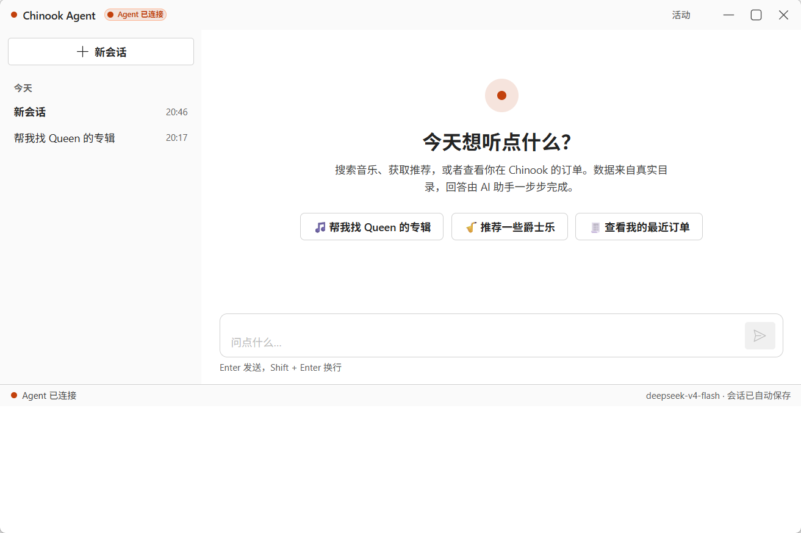
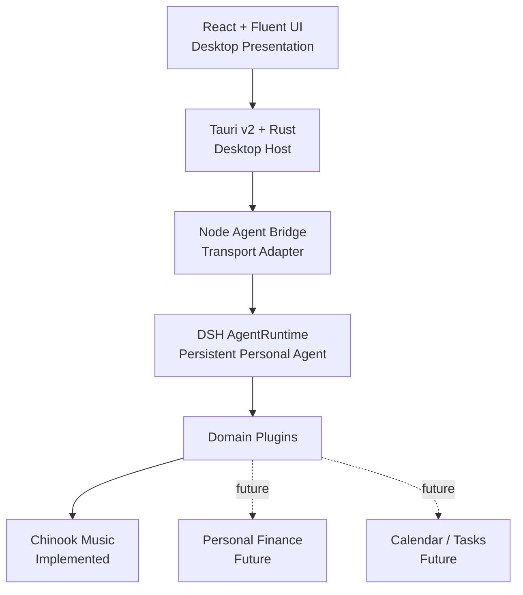

# DSH Life Assistant

English | [简体中文](README.zh-CN.md)

An extensible personal AI assistant built around user-authorized data and domain tools.

The current release ships with **Chinook Music**, the first complete domain implementation. It demonstrates how one persistent personal agent can use domain-specific tools and local data to understand preferences, search music, inspect purchase history, remember long-term interests, and provide a desktop-native interactive experience.



## What it can do today

Everything below is real and shipped in v1.0.1 — all of it powered by the Chinook Music domain.

- **Music catalog search** — find artists, albums and tracks across the catalog
- **Music recommendation** — similar albums and genre popularity, grounded in real data
- **Order lookup** — ask about your own purchase history in natural language
- **Invoice ownership protection** — invoice details are only readable for the current customer
- **Customer-scoped long-term memory** — facts are remembered per customer and used in later sessions
- **Persistent sessions** — every conversation is a durable agent session that can be restored
- **Streaming assistant responses** — replies stream token by token
- **Visible Tool Activity** — every tool call is surfaced live, not hidden inside the model
- **Desktop Activity Drawer** — a full, inspectable trace of the agent run: model turns, tool calls, timings
- **Sidecar restart recovery** — the agent process is watched, restarted and reconnected automatically
- **In-app model endpoint configuration** — point the app at any OpenAI-compatible endpoint (base URL, API key, model name) and test the connection, without touching environment variables *(on `main`, in the next installer)*

## Current Domain — Chinook Music

```
DSH Life Assistant
│
├── Shared Agent Runtime
│     ├── Session
│     ├── Memory
│     ├── Tool Calling
│     ├── Streaming
│     └── Desktop Runtime
│
└── Domain Plugins
      ├── Chinook Music        ✅ implemented (v1.0.0)
      ├── Personal Finance     ◌ future
      ├── Calendar / Tasks     ◌ future
      └── Other user-authorized data   ◌ future
```

### Why Chinook?

Chinook is not a random demo. It provides a well-structured, genuinely queryable music-store data domain, so it was chosen as the first domain implementation to validate the whole pattern end to end: domain plugins, tool calling, long-term memory, data ownership and desktop interaction.

## Architecture

One persistent DSH agent runtime, with an extensible domain boundary — the desktop host and the agent core do not change when a new domain is added.



The technical path stays explicit:

```text
React + Fluent UI
        ↓
Tauri Commands / Channels
        ↓
Rust Desktop Host
        ↓
stdin/stdout JSONL
        ↓
Node Agent Bridge
        ↓
DSH AgentRuntime
        ↓
Domain Plugin
        ↓
Tools / SQLite / Memory
```

| Layer | Role |
| --- | --- |
| React + Fluent UI | Presentation. Pure chat/timeline UI; never touches the database or the model |
| Rust Desktop Host | Window, app lifecycle, and the single long-lived agent sidecar process |
| Node Agent Bridge | Transport adapter — speaks JSONL over stdin/stdout between the host and the agent runtime |
| DSH AgentRuntime | The DeepSeek Harness agent core: sessions, model calls, tool dispatch, memory |
| Domain Plugin | Business layer — domain tools backed by SQLite and customer memory |

## Agent Tools

These are the seven tools currently provided by the Chinook Music domain:

| Tool | What it does |
| --- | --- |
| `search_catalog` | Search the music catalog by artist, album or track |
| `find_similar_albums` | Recommend albums similar to a given album |
| `popular_in_genre` | Show what is popular within a music genre |
| `list_my_orders` | List the orders of the current customer |
| `get_invoice_details` | Read the line items of one invoice (ownership-checked) |
| `remember` | Store a fact about the current customer into long-term memory |
| `recall` | Retrieve stored facts about the current customer |

## Desktop Experience

The desktop app wraps the same agent core as the original CLI. The home screen is a chat view with a live activity strip: while the agent works you see the current step (model turn, tool call, tool result) and the reply streams in real time. The title bar shows the product (**DSH Life Assistant**) and the active domain (**Chinook Music**). The **Activity Drawer** holds the full trace of each run. The sidebar lists persistent sessions, including historical ones that can be restored. The agent runs as a child Node process under the app's control — if it crashes it is restarted automatically and the session reconnects. The title-bar **设置** panel configures the model endpoint from inside the app (base URL, API key, model name — see [First Run](#first-run-configure-a-model-endpoint)); the key travels one way only, into the local credential store.

## Tech Stack

| Area | Choice |
| --- | --- |
| Frontend | React 18 + Fluent UI v9, rendered in WebView2 via Tauri v2 |
| Desktop host | Rust (Tauri v2); NSIS / MSI installers |
| Agent bridge | Node.js process bridged to Rust over stdin/stdout JSONL (esbuild bundle) |
| Agent runtime | DeepSeek Harness (DSH) AgentRuntime (`@deepseek-ai/dsh`) |
| Business layer | TypeScript domain plugin: 7 tools, SQLite services, per-customer memory |
| Data | SQLite via `better-sqlite3` — the public Chinook sample schema, plus a memory store |
| Tooling | pnpm workspace, TypeScript, Vite, Vitest, Cargo |

## Project Structure

```text
dsh-life-assistant/
├── apps/
│   ├── agent-bridge/     # Node bridge: desktop host <-> DSH JSONL transport adapter
│   ├── cli/              # Agent CLI REPL (original entry point)
│   └── desktop/          # Tauri desktop app: React frontend, Rust host, packaging
├── plugins/chinook/      # Chinook Music domain plugin: tools, services, memory
├── profiles/chinook/     # DSH profile wiring for the Chinook Music domain
├── scripts/              # bootstrap and build helpers
├── tests/                # Vitest suites: plugin, services, bridge, architecture
└── assets/screenshots/   # Project screenshots
```

## Getting Started

### Prerequisites

- Node.js ≥ 22 and pnpm
- Rust stable (MSVC toolchain) + Visual Studio Build Tools (C++) — required only for the desktop host
- Windows 10/11 with WebView2 runtime (preinstalled on Windows 11)

### 1. Install dependencies

```bash
pnpm install
```

### 2. Environment setup

Copy `.env.example` to `.env` and fill in your model credential (see [Environment](#environment)). Never commit real credentials — only `.env.example` is tracked.

### 3. Bootstrap the local data

```bash
pnpm bootstrap
```

This prepares the Chinook Music database under the local DSH home, initializes the memory store schema, and wires the profile.

### 4. Use the agent

The original CLI REPL is still available — the desktop app is the current main product entry:

```bash
pnpm chinook-agent
```

### 5. Desktop development

```bash
cd apps/desktop
node ../../node_modules/@tauri-apps/cli/tauri.js dev
```

This builds the React frontend, compiles the Rust host and opens the desktop window with hot reload.

### 6. Tests

```bash
pnpm test
cd apps/desktop/src-tauri && cargo test
```

### 7. Production build & packaging

```bash
node apps/agent-bridge/build.mjs        # bundle the bridge
node apps/desktop/scripts/stamp-runtime.mjs   # build the app's self-contained runtime image
cd apps/desktop
node ../../node_modules/@tauri-apps/cli/tauri.js build
```

The installers land in `apps/desktop/src-tauri/target/release/bundle/`:

- **NSIS installer** (`DSH Life Assistant_1.0.1_x64-setup.exe`) — the recommended Windows install format
- **MSI** (`DSH Life Assistant_1.0.1_x64_en-US.msi`) — alternative installer format

## First Run: Configure a Model Endpoint

The app has an in-app settings panel, so a fresh install can be pointed at a model endpoint without touching Windows environment variables.

1. Launch the app and click the **设置** (gear) icon in the title bar. It is present in every runtime state — including the error card, which offers a **模型设置** button of its own.
2. Fill in three fields:
   - **Base URL** — any OpenAI-compatible endpoint, e.g. `https://api.deepseek.com`. Give only the domain (or up to `/v1`); a trailing `/chat/completions` is stripped for you. Leave it empty to use the endpoint's built-in default.
   - **API Key** — issued by whichever gateway you point at (create one at the [DeepSeek open platform](https://platform.deepseek.com/)). The field starts empty every time the panel opens and its value is never read back: the key is written to the app's local credential store (`%APPDATA%\com.dsh.chinook\agent\.credentials.yaml`, owner-only) and the panel only ever reports *whether* a key resolves and from which layer. Leave it empty to keep the stored key.
   - **模型名称** — sent verbatim to the endpoint.
3. Click **保存并测试连接**. The endpoint, credential and model are saved, then exercised with one minimal real request, and the outcome is reported in Chinese — a rejected key, an unknown model, an unreachable host. A saved model applies to your next message; no restart is needed.

The panel is on `main` and is not in the v1.0.1 installer — on that build, use the environment-variable route below.

### Advanced / CI: the environment-variable route

Set `DEEPSEEK_API_KEY` as a **Windows user environment variable**, then **fully quit and reopen** the app (the variable is only read at startup; if it is still not picked up, sign out and back into Windows once):

```powershell
[Environment]::SetEnvironmentVariable(
  "DEEPSEEK_API_KEY",
  "sk-your-key",
  "User"
)
```

In compatible environments the runtime also accepts `ANTHROPIC_AUTH_TOKEN`, but only as a fallback when `DEEPSEEK_API_KEY` is unset.

**Precedence: an inherited environment variable always wins over the in-app setting.** When the app is launched with one of those variables already set, its credential store refuses to overwrite that key — so the panel reports 只读 (*supplied by the launching environment*), the key field is disabled, and the reason is spelled out rather than a save silently doing nothing. Remove the variable and restart to manage the key from the app.

Never commit real API keys to this repository — README files and commit history are public.

## Environment

| Variable | Purpose | Example |
| --- | --- | --- |
| `DEEPSEEK_API_KEY` | Primary credential for the DeepSeek-compatible model endpoint | `sk-your-key` |
| `ANTHROPIC_AUTH_TOKEN` | Fallback credential (Anthropic-format token accepted by the same endpoint) | `sk-ant-...` |
| `CHINOOK_CUSTOMER_ID` | Demo customer identity; orders/invoices/memory are scoped to it | `1` |
| `DSH_HOME` | DSH home directory override (defaults to `<repo>/.dsh` in development) | `C:\path\to\home` |

Full set with comments: `.env.example`. Unset or invalid `CHINOOK_CUSTOMER_ID` means anonymous — order, invoice and memory tools answer `IDENTITY_REQUIRED`.

Credentials set here outrank the in-app setting; the panel reports them as read-only (see [First Run](#first-run-configure-a-model-endpoint)).

## Development

```bash
pnpm build             # type-check the workspace and compile the plugin
pnpm chinook-agent     # run the agent in the CLI REPL
```

Development runs keep the DSH home in `<repo>/.dsh`. The packaged desktop app creates its own home under `%APPDATA%\com.dsh.chinook` and runs from a bundled runtime image (Node + bridge + pruned dependencies + a fresh schema-only home), so an installed machine needs neither Node nor a repository checkout.

## Testing / Build

- `pnpm test` — Vitest: 14 suites / 177 tests covering plugin services, tools, memory, the bridge (unit + integration, including the configuration surface), agent e2e, desktop reducers/form helpers and architecture invariants
- `cd apps/desktop/src-tauri && cargo test` — Rust host tests
- `pnpm build` — workspace type-check + plugin compile; the Tauri production build runs the frontend build and Rust release build, producing the NSIS/MSI installers above

## Roadmap

```text
✅ Chinook Music domain (v1.0.0 — shipped)
◌ Personal Finance domain
◌ Calendar / Tasks domain
◌ Additional user-authorized data domains
```

Future domains may include personal finance, calendars, tasks, and other user-authorized data sources. None of these are implemented today — the current architecture simply establishes the boundary needed to add additional domains without rewriting the desktop host or core agent runtime. There are no timeline commitments.

## Architecture Boundaries

- The desktop host only owns the window, the app lifecycle and the sidecar process — it contains no business logic
- The React layer is pure presentation; it never queries the database or calls the model directly
- Business rules (invoice ownership, memory scoping, catalog queries) live in the domain plugin
- The Node bridge is a thin transport adapter; all agent behavior comes from DSH and the plugin

## Known Limitations

- **Windows-first**: the desktop app is built and verified on Windows 11; other platforms are not yet covered
- **Demo identity, not authentication**: v1 uses a local demo identity (`CHINOOK_CUSTOMER_ID`); production-grade authentication is not implemented
- **Single-user and local**: data lives on the local machine; there is no server, cloud or multi-user mode
- **Requires live model credentials**: conversations need a reachable model endpoint configured in the in-app settings panel or via the environment variables above
- **Unsigned installers**: NSIS/MSI packages are not code-signed, so Windows SmartScreen may warn on first run
- **Installed app only, no standalone portable exe**: the desktop executable is distributed with its runtime resources inside the installers and has not been validated to run standalone
- **Demonstration data**: the business data is the public Chinook sample store, not a real production backend

## Acknowledgements

- **DeepSeek Harness (DSH)** — the agent runtime this project is built on
- **Chinook sample database** — the public sample music-store dataset used as the first domain's schema and data
- **Original Chinook/LangChain example** — the domain-agent idea is inspired by the classic Chinook + LangChain example ([langchain-basics](https://github.com/masoodfaisal/langchain-basics))

## License / Third-party Notice

This repository does not currently declare a license for its own source code; no license is granted until the owner chooses one.

Third-party components keep their own licenses: DeepSeek Harness packages, React, Fluent UI and `better-sqlite3` are MIT; Tauri is Apache-2.0 OR MIT. The Chinook sample database is a widely distributed public sample dataset.
