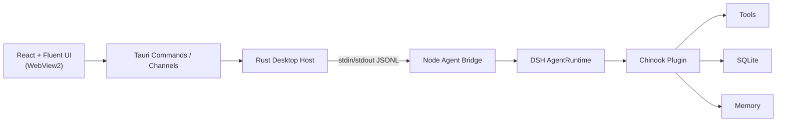

# DSH Chinook Desktop Agent

[English](README.md) | 简体中文

一个基于 DeepSeek Harness（DSH）构建的 Windows-first AI 音乐商店桌面助手，支持 Tool Calling、Session 持久化、客户级长期记忆、真实 Chinook 业务数据，以及 Agent-native 的 Tauri 桌面交互界面。


## 核心特性

- **Agent-native 桌面对话** — 与音乐商店业务 Agent 对话，而不是翻数据表
- **实时流式回复** — 助手回复逐 token 流式写入对话
- **可见的 Tool 活动** — 每一次 Tool 调用都实时展示，而不是藏在模型内部
- **音乐目录搜索** — 跨 Chinook 目录查找艺人、专辑与曲目
- **音乐推荐** — 相似专辑与流派热度，全部基于真实数据
- **订单查询** — 客户可以用自然语言查询自己的订单
- **发票所有权保护** — 发票明细只对当前客户可读
- **客户级长期记忆** — 按客户记住事实，并在后续会话中复用
- **持久化 DSH Session** — 每段对话都是一个可延续的 Agent 会话
- **历史会话恢复** — 从侧边栏重新打开旧会话继续对话
- **Activity Drawer（活动抽屉）** — 完整可查的 Agent 运行轨迹：模型回合、Tool 调用、耗时
- **Sidecar 崩溃检测与恢复** — Agent 进程被守护，崩溃后自动重启并重连会话

## 架构



| 层 | 职责 |
| --- | --- |
| React + Fluent UI | 展示层。纯对话/时间线 UI，从不直接访问数据库或模型 |
| Rust Desktop Host | 窗口、应用生命周期与单个长驻 Agent sidecar 进程 |
| Node Agent Bridge | 传输适配层 — 通过 stdin/stdout 上的 JSONL 在宿主与 Agent Runtime 之间通信 |
| DSH AgentRuntime | DeepSeek Harness Agent 核心：会话、模型调用、Tool 分发、记忆 |
| Chinook Plugin | 业务层 — 由 SQLite 与客户记忆支撑的 7 个 Chinook 领域 Tool |

## Agent 能力

Agent 向模型暴露 7 个领域 Tool：

| Tool | 作用 |
| --- | --- |
| `search_catalog` | 按艺人、专辑或曲目搜索音乐目录 |
| `find_similar_albums` | 推荐与给定专辑相似的专辑 |
| `popular_in_genre` | 展示某一音乐流派中的热门内容 |
| `list_my_orders` | 列出当前客户的订单 |
| `get_invoice_details` | 读取某张发票的明细行（带所有权校验） |
| `remember` | 将当前客户的一条事实写入长期记忆 |
| `recall` | 检索已存储的当前客户事实 |

## 桌面体验

桌面应用包装了与最初 CLI 相同的 Agent 核心。首页为对话视图，带一条实时活动条：Agent 工作时，你能看到当前步骤（模型回合、Tool 调用、Tool 结果），回复实时流式呈现。**Activity Drawer（活动抽屉）** 保存每次运行的完整轨迹。侧边栏列出持久化 DSH 会话，包括可恢复的历史会话。Agent 作为应用管控下的子 Node 进程运行——若崩溃会被自动重启并重连会话。

## 技术栈

| 领域 | 选型 |
| --- | --- |
| 前端 | React 18 + Fluent UI v9，经 Tauri v2 在 WebView2 中渲染 |
| 桌面宿主 | Rust（Tauri v2）；NSIS / MSI 安装包 |
| Agent 桥 | Node.js 进程经 stdin/stdout JSONL 与 Rust 通信（esbuild 打包） |
| Agent 运行时 | DeepSeek Harness（DSH）AgentRuntime（`@deepseek-ai/dsh`） |
| 业务层 | TypeScript Chinook 插件：7 个 Tool、SQLite 服务、按客户记忆 |
| 数据 | 经 `better-sqlite3` 使用 SQLite — 公开 Chinook 示例库结构，外加记忆存储 |
| 工具链 | pnpm workspace、TypeScript、Vite、Vitest、Cargo |

## 项目结构

```text
chinook-dsh-agent/
├── apps/
│   ├── agent-bridge/     # Node 桥：Rust <-> DSH 的 JSONL 传输适配层
│   ├── cli/              # Agent Core CLI REPL（最初入口）
│   └── desktop/          # Tauri 桌面应用：React 前端、Rust 宿主、打包
├── plugins/chinook/      # Chinook 业务插件：Tool、服务、记忆
├── profiles/chinook/     # DSH profile 装配（模型、Tool、记忆、系统提示词）
├── scripts/              # bootstrap 与构建辅助脚本
├── tests/                # Vitest 套件：插件、服务、桥、架构
└── assets/screenshots/   # 项目截图
```

## 快速开始

### 前置要求

- Node.js ≥ 22 与 pnpm
- Rust stable（MSVC 工具链）+ Visual Studio Build Tools（C++）— 仅桌面宿主需要
- Windows 10/11 及 WebView2 运行时（Windows 11 已内置）

### 1. 安装依赖

```bash
pnpm install
```

### 2. 环境配置

复制 `.env.example` 为 `.env` 并填入模型凭据（见 [环境变量](#环境变量)）。切勿提交真实凭据——仓库只跟踪 `.env.example`。

### 3. 初始化本地数据

```bash
pnpm bootstrap
```

该命令在本地 DSH home 下准备 Chinook 数据库、初始化记忆存储表结构并装配 profile。

### 4. 使用 Agent

原有 CLI REPL 仍然可用——桌面应用是当前的主要产品入口：

```bash
pnpm chinook-agent
```

### 5. 桌面开发

```bash
cd apps/desktop
node ../../node_modules/@tauri-apps/cli/tauri.js dev
```

该命令构建 React 前端、编译 Rust 宿主并打开带热重载的桌面窗口。

### 6. 测试

```bash
pnpm test
cd apps/desktop/src-tauri && cargo test
```

### 7. 生产构建与打包

```bash
node apps/agent-bridge/build.mjs        # 打包 bridge
node apps/desktop/scripts/stamp-runtime.mjs   # 生成应用自带运行时镜像
cd apps/desktop
node ../../node_modules/@tauri-apps/cli/tauri.js build
```

安装包输出到 `apps/desktop/src-tauri/target/release/bundle/`：

- **NSIS 安装包**（`DSH Chinook_1.0.0_x64-setup.exe`）— Windows 推荐安装方式
- **MSI**（`DSH Chinook_1.0.0_x64_en-US.msi`）— 备选安装格式

## 环境变量

| 变量 | 用途 | 示例 |
| --- | --- | --- |
| `DEEPSEEK_API_KEY` | DeepSeek 兼容模型端点的主要凭据 | `sk-your-key` |
| `ANTHROPIC_AUTH_TOKEN` | 备用凭据（同一端点接受的 Anthropic 格式 token） | `sk-ant-...` |
| `CHINOOK_CUSTOMER_ID` | 演示客户身份；订单/发票/记忆均以其为作用域 | `1` |
| `DSH_HOME` | DSH home 目录覆盖（开发环境默认为 `<repo>/.dsh`） | `C:\path\to\home` |

完整说明见 `.env.example`。`CHINOOK_CUSTOMER_ID` 未设置或无效即为匿名——订单、发票与记忆 Tool 会返回 `IDENTITY_REQUIRED`。

## 开发

```bash
pnpm build             # 对 workspace 做类型检查并编译插件
pnpm chinook-agent     # 在 CLI REPL 中运行 Agent
```

开发运行将 DSH home 放在 `<repo>/.dsh`。打包后的桌面应用会在 `%APPDATA%\com.dsh.chinook` 下创建自己的 home，并从内置运行时镜像（Node + bridge + 精简依赖 + 全新 schema-only home）运行，因此被安装的机器既不需要 Node，也不需要仓库检出。

## 测试

- `pnpm test` — Vitest：12 个套件 / 128 个测试，覆盖插件服务、Tool、记忆、桥（单元 + 集成）、Agent e2e、桌面 reducer 与架构不变量
- `cd apps/desktop/src-tauri && cargo test` — Rust 宿主测试

## 架构边界

- 桌面宿主只负责窗口、应用生命周期与 sidecar 进程——不含任何业务逻辑
- React 层是纯展示层，从不直接查询数据库或调用模型
- 业务规则（发票所有权、记忆作用域、目录查询）都在 Chinook 插件中
- Node 桥是薄传输适配层；所有 Agent 行为来自 DSH 与插件

## 已知限制

- **Windows-first**：桌面应用在 Windows 11 上构建并验证；其他平台尚未覆盖
- **演示身份而非认证**：`CHINOOK_CUSTOMER_ID` 只是选择客户；没有登录或访问控制层
- **单用户、本地化**：数据存放在本机；没有服务端、云端或多用户模式
- **需要可用的模型凭据**：对话依赖上面环境变量配置的可达模型端点
- **未签名安装包**：NSIS/MSI 未做代码签名，首次运行 Windows SmartScreen 可能告警
- **仅安装版，无独立便携 exe**：桌面可执行文件随运行时资源一起分装在安装包内，未验证可脱离资源独立运行
- **演示数据**：业务数据是公开 Chinook 示例商店，不是真实生产后端

## 致谢

- **DeepSeek Harness（DSH）** — 本项目所基于的 Agent 运行时
- **Chinook sample database** — 用于表结构与数据的公开示例音乐商店数据集
- **Original Chinook/LangChain example** — 业务 Agent 的创意借鉴自并重新实现自经典 Chinook + LangChain 示例（[langchain-basics](https://github.com/masoodfaisal/langchain-basics)）

## License / 第三方声明

本仓库目前未为其自身源码声明 License；在所有者选定之前不授予任何 License。

第三方组件保留各自 License：DeepSeek Harness 各包、React、Fluent UI 与 `better-sqlite3` 为 MIT；Tauri 为 Apache-2.0 OR MIT。Chinook 示例数据库是广泛流传的公开示例数据集。
